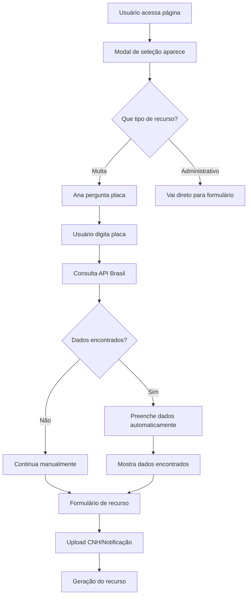

# 🎯 Popup Inicial + API Brasil Implementado

## 📋 Funcionalidade Implementada

Implementado um **popup inicial** que permite escolher entre **processo administrativo** ou **multa**, e para multas, integra com a **API Brasil** para buscar dados do veículo pela placa antes de prosseguir com o recurso.

## 🔧 Alterações Realizadas

### 1. **Modal de Seleção Inicial**

#### **resources/views/appeals/create_new.blade.php**
- ✅ **Modal popup**: Aparece ao carregar a página
- ✅ **Duas opções**: 
  - 🚗 **Recurso de Multa** (vermelho)
  - 📋 **Processo Administrativo** (roxo)
- ✅ **Design responsivo**: Funciona em mobile e desktop
- ✅ **Animações**: Hover effects e transições suaves

### 2. **Sistema de Chat para Multas**

#### **Interface de Chat**
- ✅ **Área de chat**: Aparece apenas para recursos de multa
- ✅ **Avatar da Ana**: Assistente IA especializada
- ✅ **Mensagens**: Sistema de mensagens bot/usuário
- ✅ **Input dinâmico**: Para inserção da placa

#### **Fluxo de Busca por Placa**
1. **Usuário seleciona** "Recurso de Multa"
2. **Ana pergunta** a placa do veículo
3. **Usuário digita** a placa (ex: ABC1234)
4. **Sistema consulta** API Brasil `/api/vehicle/lookup`
5. **Dados encontrados** e exibidos
6. **Formulário preenchido** automaticamente
7. **Continua** para upload de CNH/notificação

### 3. **Integração com API Brasil**

#### **Endpoint Utilizado**
```javascript
POST /api/vehicle/lookup
{
  "placa": "ABC1234"
}
```

#### **Dados Retornados**
```json
{
  "success": true,
  "data": {
    "marca": "HONDA",
    "modelo": "CIVIC LXR",
    "ano": "2019",
    "cor": "PRATA",
    "combustivel": "FLEX",
    "municipio": "SÃO PAULO",
    "uf": "SP",
    "chassi": "9BD12345678901234"
  },
  "api_info": {
    "balance": "1000",
    "message": "Consulta realizada com sucesso",
    "cost": "0.50"
  }
}
```

#### **Preenchimento Automático**
- ✅ **Placa**: Formatação automática (maiúsculas)
- ✅ **Modelo**: Marca + Modelo do veículo
- ✅ **Ano**: Ano de fabricação
- ✅ **Cor**: Cor do veículo
- ✅ **RENAVAM**: Extraído do chassi (primeiros 11 dígitos)

### 4. **JavaScript Implementado**

#### **Funções Principais**
- ✅ `selectResourceType(type)`: Seleciona tipo de recurso
- ✅ `showPlateInput()`: Mostra input para placa
- ✅ `lookupVehicleByPlate(plate)`: Consulta API Brasil
- ✅ `handleInput(value)`: Processa input do usuário
- ✅ `handleSubmit()`: Validação de placa obrigatória

#### **Controle de Estado**
```javascript
// Controle do tipo de recurso
resourceType: null, // 'multa' ou 'administrativo'
showTypeModal: true,

// Sistema de chat
messages: [],
showInput: false,
inputType: null,
currentQuestion: null,
userInput: '',
```

## 🎯 Como Funciona

### **Fluxo Completo**



### **Para Recursos de Multa**
1. **Popup inicial** → Escolhe "Recurso de Multa"
2. **Chat com Ana** → Pede placa do veículo
3. **API Brasil** → Consulta dados na base nacional
4. **Dados preenchidos** → Modelo, ano, cor, etc.
5. **Formulário** → Upload de CNH e notificação
6. **Geração** → Recurso final

### **Para Processos Administrativos**
1. **Popup inicial** → Escolhe "Processo Administrativo"
2. **Formulário direto** → Sem busca por placa
3. **Upload documentos** → CNH e outros documentos
4. **Geração** → Processo administrativo

## 🎨 Interface Implementada

### **Modal de Seleção**
```html
<div x-data="{ showTypeModal: true }" x-show="showTypeModal">
    <div class="bg-white rounded-2xl p-8 max-w-md">
        <h2>🎯 Que tipo de recurso você quer criar?</h2>
        
        <button @click="selectResourceType('multa')">
            🚗 Recurso de Multa
        </button>
        
        <button @click="selectResourceType('administrativo')">
            📋 Processo Administrativo
        </button>
    </div>
</div>
```

### **Área de Chat**
```html
<div x-show="resourceType === 'multa' && messages.length > 0">
    <div class="flex items-center">
        <div class="w-10 h-10 bg-gradient-to-r from-blue-500 to-indigo-600">
            <i class="fas fa-robot"></i>
        </div>
        <div>
            <h3>Ana - Assistente IA</h3>
            <p>Especialista em recursos de multas</p>
        </div>
    </div>
    
    <!-- Mensagens -->
    <div class="space-y-3">
        <template x-for="message in messages">
            <!-- Mensagens bot/usuário -->
        </template>
    </div>
    
    <!-- Input para placa -->
    <div x-show="showInput && currentQuestion === 'plate'">
        <input type="text" x-model="userInput" @keydown.enter="handleInput(userInput)">
    </div>
</div>
```

## 🚀 Benefícios da Implementação

### ✅ **Experiência Melhorada**
- **Fluxo claro**: Usuário sabe exatamente o que está fazendo
- **Chat conversacional**: Interface amigável com Ana
- **Dados automáticos**: Sem necessidade de digitar dados do veículo

### ✅ **Integração com API Brasil**
- **Dados oficiais**: Consulta na base nacional do DETRAN
- **Preenchimento automático**: Modelo, ano, cor, etc.
- **Fallback inteligente**: Continua manualmente se não encontrar

### ✅ **Validação Robusta**
- **Placa obrigatória**: Para recursos de multa
- **Formato validado**: AAA0000 ou AAA0A00
- **Tratamento de erros**: Mensagens claras para o usuário

### ✅ **Performance Otimizada**
- **Consulta rápida**: API Brasil responde em segundos
- **Dados precisos**: Informações oficiais do veículo
- **UX fluida**: Transições suaves entre etapas

## 📊 Dados Preenchidos Automaticamente

### **Via API Brasil**
- **Marca**: Honda, Volkswagen, etc.
- **Modelo**: Civic, Gol, etc.
- **Ano**: 2019, 2020, etc.
- **Cor**: Prata, Branco, etc.
- **Combustível**: Flex, Gasolina, etc.
- **Município/UF**: Local de registro
- **Chassi**: Para RENAVAM (primeiros 11 dígitos)

## 🔄 Fluxo de Validação

### **Para Recursos de Multa**
1. **Placa obrigatória**: Valida se foi informada
2. **Formato válido**: AAA0000 ou AAA0A00
3. **Consulta API**: Busca dados na base nacional
4. **Dados encontrados**: Preenche automaticamente
5. **Fallback**: Continua manualmente se necessário

### **Para Processos Administrativos**
1. **Sem validação de placa**: Não é necessário
2. **Formulário direto**: Vai direto para os campos
3. **Upload flexível**: CNH e outros documentos

## 📁 Arquivos Modificados

### **Frontend**
- `resources/views/appeals/create_new.blade.php` - Modal + Chat + Integração

### **Backend (Já Existia)**
- `app/Http/Controllers/Api/VehicleController.php` - API Brasil
- `routes/api.php` - Rota `/api/vehicle/lookup`

## 🎯 Próximos Passos

1. **Testar** o popup inicial
2. **Validar** integração com API Brasil
3. **Ajustar** mensagens da Ana se necessário
4. **Monitorar** taxa de sucesso nas consultas
5. **Otimizar** UX baseado no feedback

## 📝 Observações

- **API Brasil funcional**: Já estava implementada e funcionando
- **Modal responsivo**: Funciona em todos os dispositivos
- **Chat intuitivo**: Interface conversacional com Ana
- **Dados precisos**: Informações oficiais do DETRAN
- **Fallback robusto**: Continua funcionando mesmo com erros

---

**Status**: ✅ **Implementado com Sucesso**  
**Impacto**: UX Melhorada + Dados Automáticos  
**Data**: Janeiro 2024 