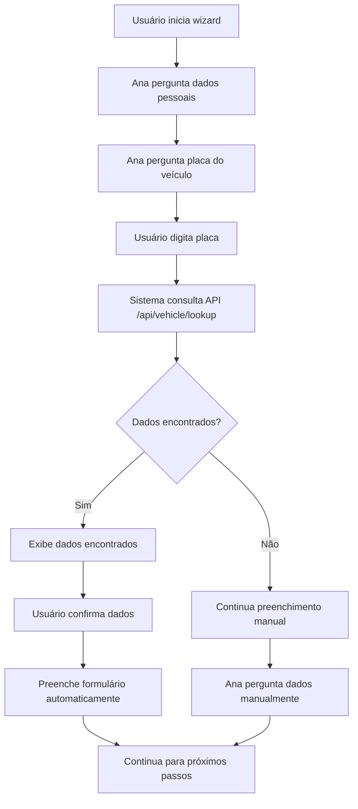

# 🚗 Remoção do Upload de Documento do Veículo

## 📋 Alteração Implementada

Removido o sistema de **upload de documento do veículo (CRLV)** e mantida apenas a **busca automática por placa** que já existe no wizard.

## 🔧 Alterações Realizadas

### 1. **Frontend - Remoção da Seção de Upload**

#### **resources/views/appeals/create_new.blade.php**
- ❌ **Seção removida**: Terceira coluna com upload do documento do veículo
- ❌ **Grid ajustado**: Voltou para 2 colunas (CNH | Notificação)
- ❌ **Funções JavaScript removidas**:
  - `handleVehicleFileSelect()`
  - `handleVehicleFileDrop()`
  - `clearVehicleUpload()`
- ❌ **Processamento de dados removido**: Parte do `fillFormWithExtractedData()` para veículo
- ❌ **Estado removido**: `vehicle: null` do objeto `uploadedFiles`

### 2. **Funcionalidade Mantida - Busca por Placa**

#### **wizard.blade.php já possui:**
- ✅ **Busca automática**: Função `lookupVehicle(plate)` no chat-wizard.js
- ✅ **API endpoint**: `/api/vehicle/lookup` para consulta por placa
- ✅ **Preenchimento automático**: Modelo, ano, cor, marca, etc.
- ✅ **Validação**: Confirmação dos dados encontrados
- ✅ **Fallback**: Continua manualmente se não encontrar dados

## 🎯 Como Funciona Agora

### **No Wizard (Self-Service)**
1. **Ana pergunta** a placa do veículo
2. **Usuário digita** a placa (ABC1234)
3. **Sistema consulta** a API `/api/vehicle/lookup`
4. **Dados são encontrados** e exibidos
5. **Usuário confirma** se os dados estão corretos
6. **Formulário é preenchido** automaticamente

### **API de Consulta**
```javascript
// Endpoint usado no wizard
POST /api/vehicle/lookup
{
  "placa": "ABC1234"
}

// Resposta esperada
{
  "success": true,
  "data": {
    "marca": "HONDA",
    "modelo": "CIVIC LXR",
    "ano": "2019",
    "cor": "PRATA",
    "combustivel": "FLEX",
    "municipio": "SÃO PAULO",
    "uf": "SP"
  },
  "api_info": {
    "message": "Consulta realizada com sucesso"
  }
}
```

## 📊 Dados Preenchidos Automaticamente

### **Dados do Veículo (via API)**
- **Marca**: Honda, Volkswagen, etc.
- **Modelo**: Civic, Gol, etc.
- **Ano**: 2019, 2020, etc.
- **Cor**: Prata, Branco, etc.
- **Combustível**: Flex, Gasolina, etc.
- **Município/UF**: Local de registro

## 🔄 Fluxo Atualizado



## 🎨 Interface Atualizada

### **Página de Recursos**
- ✅ **2 seções**: CNH (verde) | Notificação (azul)
- ❌ **Removido**: Terceira seção roxa do documento do veículo
- ✅ **Grid responsivo**: 2 colunas no desktop, 1 no mobile

### **Wizard (Self-Service)**
- ✅ **Mantido**: Chat com Ana
- ✅ **Busca por placa**: Funcionalidade preservada
- ✅ **UX otimizada**: Apenas digite a placa

## 📁 Arquivos Modificados

### **Frontend**
- `resources/views/appeals/create_new.blade.php` - Removida seção de upload

### **Arquivos NÃO Modificados**
- `resources/views/self-service/wizard.blade.php` - Mantido
- `public/js/chat-wizard.js` - Mantido
- Controllers de API - Mantidos

## 🚀 Benefícios da Mudança

### ✅ **Simplicidade**
- **Menos campos**: Usuário só precisa digitar a placa
- **Mais rápido**: Sem upload de arquivos
- **Menos erros**: Dados vêm direto da base nacional

### ✅ **Experiência Unificada**
- **Wizard otimizado**: Foco na busca por placa
- **API confiável**: Dados oficiais do DETRAN
- **Preenchimento automático**: Modelo, ano, cor, etc.

### ✅ **Performance**
- **Menos processamento**: Sem OCR ou IA para documentos
- **Mais rápido**: Consulta direta por placa
- **Menos recursos**: Sem upload/storage de arquivos

## 📋 Próximos Passos

1. **Testar** a busca por placa no wizard
2. **Verificar** se a API `/api/vehicle/lookup` está funcionando
3. **Ajustar prompts** da Ana se necessário
4. **Monitorar** taxa de sucesso nas consultas

## 📝 Observações

- **Funcionalidade mantida**: O wizard já tinha busca por placa funcionando
- **Apenas removido**: Upload de documento desnecessário
- **Experiência melhorada**: Mais simples e eficiente
- **API preservation**: Endpoint de consulta por placa mantido

---

**Status**: ✅ **Removido com Sucesso**  
**Impacto**: Simplificação da UX  
**Data**: Janeiro 2024 